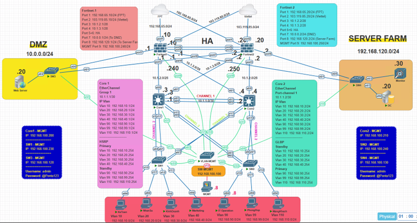
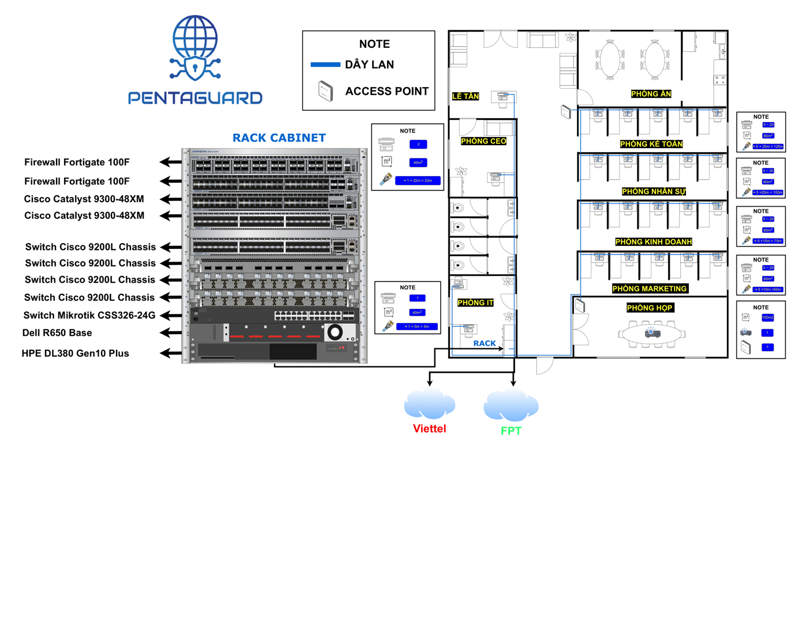

# Dự án: Thiết kế và Triển khai Hạ tầng Mạng Nội bộ theo Tiêu chuẩn An toàn Thông tin

## Giới thiệu

Dự án này tập trung vào việc thiết kế và triển khai một hạ tầng mạng nội bộ an toàn và hiệu quả cho công ty PVS, tuân thủ các tiêu chuẩn an toàn thông tin hiện hành. Mục tiêu là giải quyết các vấn đề hiện tại về bảo mật và hiệu suất mạng mà doanh nghiệp đang gặp phải, đồng thời đáp ứng các yêu cầu về khả năng mở rộng và độ tin cậy.

## Tổng quan Doanh nghiệp (Công ty PVS)

**Hiện trạng và Vấn đề:**
Công ty PVS hiện đang đối mặt với các thách thức về bảo mật và hiệu suất mạng, bao gồm:
* Nguy cơ tấn công mạng và rò rỉ dữ liệu.
* Thiếu hụt các giải pháp bảo mật toàn diện.
* Hệ thống mạng hiện tại chưa tối ưu, có thể gây ra nghẽn cổ chai và giảm hiệu suất làm việc.

**Yêu cầu của Doanh nghiệp:**
* Nâng cao bảo mật toàn diện cho hạ tầng mạng.
* Đảm bảo tính sẵn sàng và hiệu suất cao của hệ thống mạng.
* Triển khai các công nghệ mới để hỗ trợ các hoạt động kinh doanh phát triển.
* Tuân thủ các quy định về an toàn thông tin.

## Định hướng Nghiên cứu và Các Công nghệ Triển khai

Dự án nghiên cứu và áp dụng các công nghệ tiên tiến để xây dựng một hệ thống mạng mạnh mẽ và an toàn:

* **VLAN (Virtual Local Area Network):** Phân chia mạng vật lý thành nhiều mạng logic để tăng cường bảo mật và quản lý lưu lượng.
* **Spanning Tree Protocol (STP) / BPDU Guard / Root Guard:** Ngăn chặn các vòng lặp trong mạng và bảo vệ cấu trúc cây STP.
* **Port Security:** Ngăn chặn truy cập trái phép vào các cổng chuyển mạch bằng cách giới hạn số lượng địa chỉ MAC được phép trên một cổng.
* **High Availability (HA):** Đảm bảo hệ thống mạng luôn sẵn sàng hoạt động, giảm thiểu thời gian ngừng dịch vụ.
* **Load Balancing (Tải cân bằng):** Phân phối lưu lượng mạng giữa nhiều thiết bị để cải thiện hiệu suất và độ tin cậy.
* **EtherChannel:** Gộp nhiều cổng vật lý thành một kênh logic duy nhất để tăng băng thông và khả năng dự phòng.
* **Gateway Load Balancing Protocol (GLBP):** Cung cấp khả năng cân bằng tải cho gateway, cho phép nhiều router hoạt động như một gateway ảo duy nhất.
* **Firewall Fortinet:** Triển khai tường lửa thế hệ mới để bảo vệ mạng khỏi các mối đe dọa từ bên ngoài và kiểm soát lưu lượng.
* **Dịch vụ DNS, DHCP, Web Server:** Thiết lập các dịch vụ mạng cơ bản để hỗ trợ hoạt động của công ty.

## Sơ đồ Mạng Logical

Dưới đây là sơ đồ mạng logical của hệ thống được đề xuất:

## Sơ đồ Mạng Vật lý

Và đây là sơ đồ mạng vật lý minh họa cách các thiết bị được kết nối:

## Quy trình Triển khai Dự án

Dự án được thực hiện theo các giai đoạn chính sau:

1.  **Phân tích Yêu cầu & Thiết kế:**
    * Thu thập và phân tích yêu cầu từ công ty PVS.
    * Thiết kế kiến trúc mạng logical và physical.
    * Lựa chọn công nghệ và thiết bị phù hợp.

2.  **Triển khai Hạ tầng Core:**
    * Cấu hình VLAN để phân tách các phòng ban và loại hình lưu lượng.
    * Triển khai STP với BPDU Guard và Root Guard để ngăn chặn vòng lặp và bảo vệ Root Bridge.
    * Cấu hình EtherChannel để tăng băng thông và dự phòng giữa các switch.

3.  **Triển khai Lớp Phân phối và Truy cập:**
    * Cấu hình Port Security trên các cổng truy cập để ngăn chặn truy cập trái phép.
    * Triển khai các biện pháp bảo mật tại lớp truy cập.

4.  **Triển khai Dịch vụ và Bảo mật:**
    * Cấu hình Firewall Fortinet để kiểm soát lưu lượng vào/ra, thiết lập các chính sách bảo mật và ngăn chặn xâm nhập.
    * Thiết lập các dịch vụ như DNS, DHCP để quản lý địa chỉ IP và phân giải tên miền.
    * Cấu hình Web Server nếu cần thiết cho các ứng dụng nội bộ.

5.  **Triển khai Tính sẵn sàng cao và Cân bằng tải:**
    * Cấu hình GLBP (Gateway Load Balancing Protocol) để cân bằng tải cho các gateway, đảm bảo tính sẵn sàng cao.
    * Triển khai các giải pháp HA cho các thiết bị quan trọng như router, firewall.

6.  **Kiểm thử và Đánh giá:**
    * Thực hiện kiểm thử chức năng và hiệu suất của toàn bộ hệ thống.
    * Đánh giá mức độ tuân thủ các tiêu chuẩn an toàn thông tin.
    * Điều chỉnh và tối ưu hóa theo kết quả kiểm thử.

7.  **Tài liệu hóa:**
    * Ghi lại chi tiết cấu hình, sơ đồ và quy trình triển khai để hỗ trợ bảo trì và phát triển trong tương lai.

## Đóng góp

Mọi đóng góp cho dự án này đều được hoan nghênh. Vui lòng tạo một Pull Request hoặc mở một Issue nếu bạn có bất kỳ đề xuất hoặc phát hiện lỗi nào.

## Video Demo Dự án
https://www.youtube.com/watch?v=X2yUj7eWrxE

---